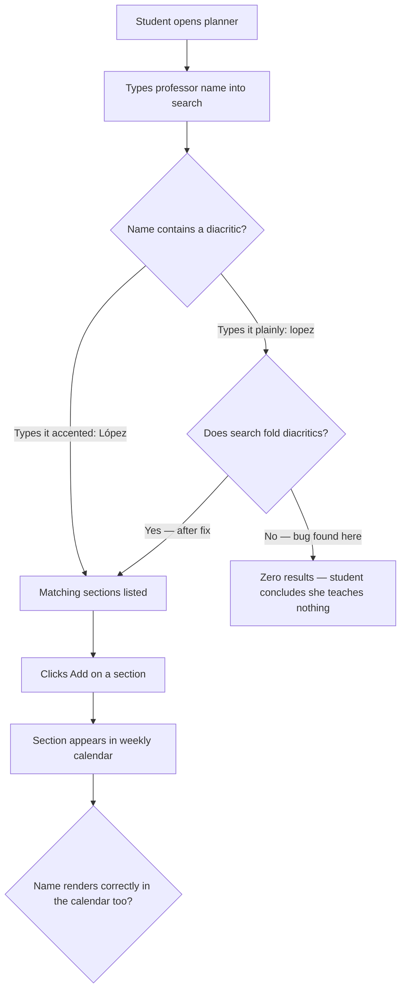
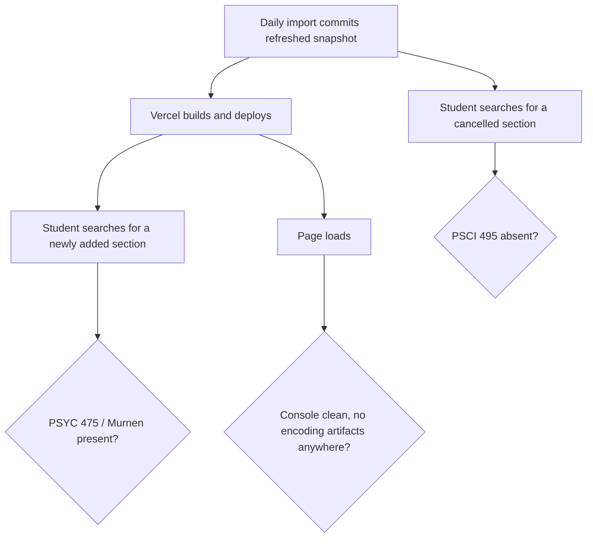
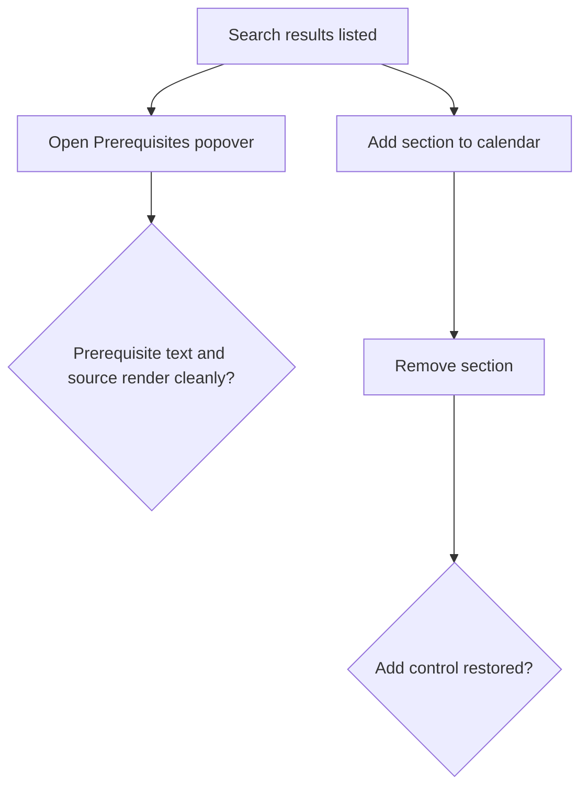

# Dogfood report — `feat/scheduled-course-scraper`

**Date:** 2026-08-06
**Branch:** `feat/scheduled-course-scraper` vs `main`
**Status:** Complete — 6/6 scenarios pass, 1 bug found and fixed

---

## Diff summary

Eight commits hardening the Fall 2026 import pipeline for unattended daily runs, plus the scheduled workflow itself.

| Area | Files | Browser-visible? |
|---|---|---|
| Import pipeline | `scripts/courses/import-fall-2026.ts`, `scripts/courses/parse-schedule.ts` | No — build-time only |
| Report schema | `src/lib/courses/types.ts` | No — type + report shape |
| Scheduled job | `.github/workflows/daily-course-import.yml`, `.github/last-successful-import` | No — CI |
| Docs | `README.md`, `CLAUDE.md`, `docs/plans/…-plan.md` | No |
| Tests/fixtures | `tests/scripts/*`, `tests/fixtures/kenyon/…windows-1252.html` | No |
| **Committed data** | **`src/data/fall-2026.json`**, `src/data/fall-2026.import-report.json` | **Yes** — the planner renders this |

The entire user-visible surface of this branch is the refreshed snapshot. Nine sections differ from `main`:

- **6 encoding repairs** (the U1 fix): `L�pez, I` → `López, I` (3 sections), `del R�o Arrillaga, D` → `del Río Arrillaga, D` (3 sections).
- **3 genuine upstream drift** between Aug 5 and Aug 6: PSCI 495 (CRN 80406) removed, PSYC 475 (CRN 80369, Murnen) added, AMST 497Y instructor Powers → Gourrier.

Section count held at 629 both times. That the roster churned while the count stayed flat is itself evidence the daily cadence is warranted — and that a count-only guard would not have noticed.

---

## Personas

No `STRATEGY.md`, `VISION.md`, or persona docs exist in this repo, so these are **inferred** from the README and the product surface.

- **P1 — Kenyon undergraduate planning Fall 2026 (primary).** Anonymous, no account. Searches by department, course title, or professor name; wants times and conflicts visible at a glance; needs to trust the data matches the registrar. Types on a US keyboard.
- **P2 — Maintainer (repo owner).** Never uses the browser for this; cares that the scheduled import lands correct data in production without supervision.

---

## Flows tested

### Flow A — Find a professor by name and schedule their course

### Flow B — Refreshed roster reaches the browser

### Flow C — Core planner still works on refreshed data

---

## Test matrix & results

| # | Scenario | Persona | Result | Notes |
|---|---|---|---|---|
| S1 | Accented instructor names render correctly | P1 | **Pass** | 0 U+FFFD in rendered HTML; 3× `López`, 3× `del Río Arrillaga` correct |
| S2 | Search by accented and unaccented instructor name | P1 | **Fail → Fixed** | `lopez`/`rio` returned 0 results. Fixed in `9276b16`; now 3 each |
| S3 | Fresh-scrape roster drift is live | P1, P2 | **Pass** | PSYC 475/Murnen present, PSCI 495 absent, AMST 497Y shows Gourrier |
| S4 | Add accented-instructor course to calendar | P1 | **Pass** | Both Tue/Thu events placed at 8:10–9:30 SMA306; Remove restored Add |
| S5 | Prerequisites popover on refreshed data | P1 | **Pass** | Text, disclaimer, and official source href all correct |
| S6 | No console errors on the refreshed snapshot | P2 | **Pass** | No errors on load or at 390px; 629 cards in DOM = 629 in snapshot |

Post-fix verification: 132 unit tests, 12 e2e tests, typecheck, and lint all green.

---

## What was fixed

### Search ignored diacritics — `9276b16`

**Symptom.** Typing `lopez` returned zero results; `López` returned three. Same for `rio` vs `Río`.

**Root cause.** `normalizeSearchText` in `src/lib/courses/search.ts` lowercased but never folded diacritics, so the accented and unaccented spellings never met.

**Why this branch surfaced it.** Before the encoding fix, these names were stored as mojibake (`L�pez`), so nobody could find them by any spelling and the gap was invisible. Making the data correct is what turned a dormant flaw into a live one — the fix and the bug are causally linked, which is why it belonged in this branch rather than a follow-up.

**Fix.** Normalize to NFD and strip the combining-marks range on both the query and the searchable text, so either spelling finds the other. Deliberately uses `[̀-ͯ]` rather than `\p{Diacritic}`, which requires ES2018 while `tsconfig.json` targets ES2017.

**Regression test.** Seven parameterized cases in `tests/lib/search.test.ts` covering `lopez`/`Lopez`/`López`/`lópez`/`rio`/`Río`/`del rio arrillaga`, plus a negative case ensuring non-matching instructors are still excluded. Verified failing before the fix (4 red) and passing after.

---

## Paper cuts (by persona)

| Paper cut | Persona | Severity | Status |
|---|---|---|---|
| Unaccented instructor search returned nothing | P1 | **High** — silently hides three sections and reads as "this professor teaches nothing" | **Fixed** (`9276b16`) |
| All 629 course cards render into the DOM at once, with no virtualization | P1 | Low–Medium — fine on a laptop, likely sluggish on an older phone | **Deferred** — pre-existing, not introduced by this branch |
| Calendar events show course code, time, and room but not the instructor | P1 | Low — a student scheduling *around a professor* has to go back to search to confirm | **Deferred** — a design choice, not a defect |
| Prerequisite text is unavailable for 49 sections | P1 | Low — already disclosed honestly in the UI, and driven by upstream catalog gaps | **Deferred** — upstream data limitation |

---

## Decisions for a human

None. The single failure found was small, unambiguous, and contained to one function plus its test, which put it squarely in the auto-fix band. Nothing encountered required an architectural, schema, or product-behavior judgment.

---

## Learnings

1. **Fixing a data-correctness bug can activate a dormant consumer bug.** The mojibake masked the search gap: with `L�pez` in the data, *no* query matched, so the missing diacritic folding was invisible. Whenever a fix makes previously-corrupt data correct, audit every consumer that reads that field — correctness upstream can expose latent assumptions downstream.

2. **Diff-scoped dogfooding must follow the data, not just the code.** Ten of the thirteen changed files were build-time scripts, CI, or docs with no browser surface at all. The only user-visible change was a JSON file — and that is exactly where the bug lived. Scoping by "which files changed" would have suggested there was nothing to test in a browser.

3. **A flat section count is a weak integrity signal.** The roster churned by one added and one removed section while the total stayed at exactly 629. The tolerance band added in U3 would have seen `delta: 0` and reported no drift. Worth knowing that count stability does not imply content stability.

4. **`tsconfig` target silently constrains regex features.** Both `\p{Diacritic}` (ES2018 property escapes) and the `s`/dotAll flag are unavailable at the ES2017 target this repo uses, and each failed only at `tsc` time, not at test time. Reach for explicit codepoint ranges in this codebase.

---

## Final status

**Ready.** All six matrix scenarios pass, the one bug found is fixed with regression coverage, and the full verification suite is green (132 unit, 12 e2e, typecheck, lint, build).

### Still needs human verification

These cannot be exercised locally and remain unproven until the branch merges:

- **The scheduled workflow has never actually run.** Trigger it via **Run workflow** on the Actions tab once merged.
- **`main` must accept pushes from `github-actions[bot]`.** If branch protection is enabled, the commit step will fail on the first changed scrape.
- **Vercel's production deploy from an automated commit** — verify the first bot-authored commit deploys as expected.
