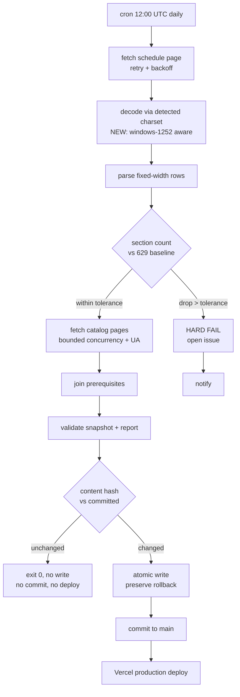

# feat: Harden the Fall 2026 import pipeline for unattended daily scraping

## Summary

Make `npm run data:import` safe to run unattended, then schedule it daily at 08:00 America/New_York via GitHub Actions, auto-committing changed snapshots to `main` so Vercel redeploys.

Four hardening changes carry the weight: correct character decoding of the registrar source (fixing a **confirmed live data bug**), retry-with-backoff on transient fetches, bounded and identified concurrency against Kenyon's servers, and content-based change detection so unchanged scrapes produce no commit. The reviewed-section floor becomes a tolerance band, because the live page currently sits exactly at the floor with zero headroom.

Firecrawl was evaluated against the live page with real scrapes. **Recommendation: do not adopt it for the primary path** — reasoning in KTD-5.

---

## Problem Frame

The import pipeline was built as a supervised maintainer action: strict, all-or-nothing, and safe to fail loudly because a human was always watching. Running it on a schedule inverts that assumption. Every strictness that was a virtue under supervision becomes an outage under automation.

Three concrete problems, all verified against the live source during planning:

**A live encoding bug is already shipping.** `https://registrar.kenyon.edu/sep26_dept.htm` is served as `text/html` with **no charset declaration**, and its bytes are Windows-1252. `Response.text()` assumes UTF-8, so high bytes become U+FFFD. The committed snapshot contains 6 mangled instructor names today — `López, I` is stored as `L�pez, I`, and `del Río Arrillaga, D` as `del R�o Arrillaga, D`. This is independent of scheduling and should be fixed regardless.

**The section floor has zero headroom.** `FALL_2026_REVIEWED_MINIMUM_SECTION_COUNT` is 629. The live page returns exactly 629 section rows. The first cancelled section fails the import and keeps failing until a human edits the constant — guaranteed breakage, not hypothetical.

**Nothing survives a bad network day.** `fetchText` has no retry. Catalog traversal fans out to up to 100 pages through an uncapped `Promise.all` with no identifying User-Agent and no delay. One 503 fails the run; a daily burst of ~100 simultaneous requests is a plausible way to earn a block.

Additionally, `importedAt` is stamped from `now()` on every run and embedded in both artifacts, so an unchanged scrape still produces a diff — under auto-commit that means a daily no-op commit and a daily Vercel deploy.

---

## Requirements

- **R1** — The importer decodes the registrar and catalog sources using their actual character encoding; accented instructor names round-trip correctly into the snapshot.
- **R2** — Transient network failures (timeouts, 5xx, connection resets) are retried with backoff before the run is considered failed.
- **R3** — Concurrent requests to Kenyon hosts are capped, and requests carry an identifying User-Agent.
- **R4** — A scrape whose section data is unchanged from the committed snapshot produces no commit and no deploy.
- **R5** — A section-count drop within tolerance is accepted and reported; a drop beyond tolerance hard-fails the run.
- **R6** — The import runs automatically at 08:00 America/New_York daily, committing changed snapshots to `main`.
- **R7** — A failed or anomalous run is visible without anyone watching the schedule.
- **R8** — Existing guarantees hold unchanged: hostname allowlist, atomic artifact replacement with rollback, and full schema validation on the written bytes.

---

## High-Level Technical Design

Directional guidance for review, showing where the new gates sit relative to the existing pipeline.

The content hash covers **section data only**, deliberately excluding `importedAt` and per-page `retrievedAt` timestamps — otherwise every run hashes differently and R4 cannot hold.

---

## Key Technical Decisions

### KTD-1 — Decode by detected charset, defaulting to Windows-1252 on decode failure

`fetchText` reads `response.arrayBuffer()` rather than `.text()`, then picks an encoding: the `charset` from `Content-Type` if present, else a `<meta charset>` sniff of the leading bytes, else attempt strict UTF-8 and fall back to Windows-1252 when that fails. Windows-1252 never fails to decode, which makes it a safe terminal fallback; strict-UTF-8-first means correctly-declared UTF-8 pages are unaffected.

Rationale: the registrar page declares nothing and is Windows-1252, while the catalog pages are modern and UTF-8. A blanket assumption in either direction corrupts one of the two sources.

### KTD-2 — Tolerance band replaces the hard section floor

`assertFall2026ScheduleCompleteness` gains a tolerance concept: accept counts at or above the baseline; accept drops up to a threshold (proposed: the greater of 15 sections or 2%) while surfacing the delta prominently; hard-fail beyond it. A large drop is far more likely to mean a truncated response or a format change than genuine mass cancellation.

The reviewed baseline constant stays as the reference point — it becomes the number deltas are measured *against*, not a floor that trips.

### KTD-3 — Content hash excludes timestamps; `importedAt` only advances on real change

When the newly-scraped section array hashes identically to the committed snapshot's, the run exits successfully without touching either artifact. This makes `importedAt` a meaningful "data last changed" signal instead of "job last ran", and it is what keeps auto-commit from producing 365 empty commits and 365 Vercel deploys per year.

### KTD-4 — GitHub Actions, cron at 12:00 UTC, with an explicit DST caveat

Actions is the right host: the remote already exists, Vercel already deploys from `main`, and a laptop is not reliably awake at 08:00. GitHub cron is **UTC-only with no DST awareness**, so `0 12 * * *` is 08:00 EDT in summer and 07:00 EST in winter. Accepting one hour of winter drift is simpler than a two-schedule workaround, and the registrar page regenerates on its own cadence anyway. Revisit only if the drift proves to matter.

Two Actions-specific facts the workflow must account for: scheduled workflows are **disabled after 60 days of repository inactivity** (a data-freshness job silently stopping is the exact failure this plan exists to prevent), and scheduled runs are **delayed or dropped under platform load**, so 08:00 is best-effort, not a guarantee.

### KTD-5 — Do not adopt Firecrawl for the primary scrape path

Evaluated by scraping the live registrar page with the installed CLI (v1.16.2, authenticated) and diffing the result against a direct `curl`.

**What Firecrawl genuinely does well here:** it detected the undeclared Windows-1252 encoding and returned clean UTF-8 — `López` and `del Río Arrillaga` came through with zero replacement characters. It also preserved the `<pre>` block's fixed-width alignment, so the existing column-slice parser ran against its `rawHtml` output unchanged.

**Why it still isn't the right call:**

- **Its one real win is a small native fix.** Correct decoding is KTD-1 — a bounded change to one function. Taking on a paid third-party dependency to solve it is disproportionate.
- **The page needs nothing Firecrawl is for.** The registrar page has **zero `<script>` tags**, returns HTTP 200 in ~0.67s, and presents no bot challenge. JS rendering, browser automation, and anti-bot infrastructure are all unused value.
- **Credit cost is prohibitive at this cadence.** ~101 pages per run (1 schedule + up to 100 catalog) × 365 runs ≈ 36,900 scrapes/year against a balance currently showing 1,151 credits.
- **It caches by default.** The evaluation scrape returned content that differed from the live page in row ordering and some instructor assignments — consistent with a cached copy. For a job whose entire purpose is freshness, a caching layer is a correctness hazard requiring explicit cache-busting to neutralize.
- **It weakens an existing security property.** `assertApprovedSourceUrl` validates `response.url` against a hostname allowlist. Routing through a third party means that check no longer attests that the bytes came from Kenyon.

**Where it stays relevant:** if Kenyon begins blocking GitHub Actions' shared IP ranges — a realistic risk when moving off a residential IP — Firecrawl becomes a sound fallback fetch path, since its proxy infrastructure is precisely the mitigation. Documented as a contingency in Risks, not built now.

---

## Implementation Units

### U1. Correct character decoding of source pages

**Goal:** Instructor names with non-ASCII characters round-trip correctly; the 6 mangled names in the committed snapshot are repaired.
**Requirements:** R1
**Dependencies:** none
**Files:**
- `scripts/courses/import-fall-2026.ts` (modify `fetchText`)
- `tests/scripts/import-fall-2026.test.ts` (extend)
- `tests/fixtures/kenyon/fall-2026-schedule-windows-1252.html` (new binary fixture)
- `src/data/fall-2026.json`, `src/data/fall-2026.import-report.json` (regenerated)

**Approach:** Per KTD-1. Keep the decode decision inside `fetchText` so both source kinds benefit and the redirect/timeout logic is untouched. The new fixture must be committed as real Windows-1252 bytes, not UTF-8 — a UTF-8 fixture cannot reproduce the bug.

**Execution note:** Write the failing test first. The bug is confirmed and reproducible, so a red test proves the fix rather than assuming it.

**Patterns to follow:** existing fixture-driven tests in `tests/scripts/parse-schedule.test.ts`.

**Test scenarios:**
- Windows-1252 fixture with no charset declaration decodes `López,I,,` and `del Río Arrillaga,D,,` intact; snapshot contains zero U+FFFD.
- A page served with explicit `Content-Type: text/html; charset=utf-8` decodes as UTF-8 and is unaffected by the fallback.
- A page with a `<meta charset="utf-8">` tag but no header charset decodes as UTF-8.
- Bytes that are valid UTF-8 are never re-decoded as Windows-1252 (guards against corrupting the catalog pages).
- Regenerated snapshot passes `validateCourseSnapshot` with the corrected names.

**Verification:** `npm run data:import` against fixtures yields a snapshot with no replacement characters; `grep` for U+FFFD in `src/data/fall-2026.json` returns nothing.

---

### U2. Retry with backoff, bounded concurrency, and an identifying User-Agent

**Goal:** A transient failure or a slow origin no longer fails the run, and the job stops behaving like a burst scraper.
**Requirements:** R2, R3, R8
**Dependencies:** none
**Files:**
- `scripts/courses/import-fall-2026.ts` (modify `fetchText`, `fetchCatalogBranch`)
- `tests/scripts/import-fall-2026.test.ts` (extend)

**Approach:** Wrap the request in a retry loop — proposed 3 attempts with exponential backoff — retrying only genuinely transient conditions (timeouts, connection errors, 429, 5xx). **4xx other than 429 must not be retried**; a 404 on a catalog page is a real structural signal the pipeline should surface, not paper over. Replace the uncapped `Promise.all` in catalog traversal with a bounded worker pool (proposed: 4 concurrent) and set a descriptive User-Agent identifying the project and a contact URL.

Retries must sit *inside* the existing per-request timeout accounting so a retrying request cannot extend the run unboundedly. The hostname allowlist check runs on every attempt, including every redirect hop — this is load-bearing and must not be bypassed by the retry wrapper.

**Patterns to follow:** the existing `AbortController` and redirect-validation structure already in `fetchText`.

**Test scenarios:**
- Two consecutive 503s followed by a 200 succeeds; the fetch implementation is called exactly 3 times.
- Three consecutive 503s fails the run with an error naming the URL and attempt count.
- A 404 fails immediately without retrying.
- A 429 is retried.
- Backoff delays increase between attempts (assert against an injected clock, not wall time).
- Catalog traversal with 20 discovered pages never has more than 4 requests in flight simultaneously.
- Every outbound request carries the User-Agent header.
- A redirect to a non-allowlisted host still throws on a retried attempt.

**Verification:** Tests demonstrate retry and concurrency behavior with an injected `fetchImpl`; no live network access in the test suite.

---

### U3. Tolerance band for section-count drops

**Goal:** Ordinary cancellations pass with a visible delta; suspicious drops hard-fail.
**Requirements:** R5
**Dependencies:** none
**Files:**
- `scripts/courses/parse-schedule.ts` (modify `assertFall2026ScheduleCompleteness`)
- `scripts/courses/import-fall-2026.ts` (thread tolerance through `validateImportReport`)
- `tests/scripts/parse-schedule.test.ts` (extend)

**Approach:** Per KTD-2. Keep `KENYON_FALL_2026_MINIMUM_SECTIONS` working as a maintainer override so the documented escape hatch survives. The delta must be carried into the import report so U5 can surface it — a silent acceptance defeats the purpose.

**Patterns to follow:** the existing env-override parsing in `minimumSectionCountFromEnvironment`.

**Test scenarios:**
- 629 sections against a 629 baseline: accepted, delta 0.
- 627 against 629: accepted, delta -2 recorded in the report.
- 615 against 629 (at the 15-section edge): accepted, delta recorded — assert the boundary explicitly.
- 613 against 629: hard-fails with an error naming both counts.
- 0 sections: hard-fails (existing empty-schedule guard still fires first).
- A count *above* baseline is accepted without a delta warning.
- The env override still forces a specific baseline.

**Verification:** `npm run data:verify` passes against the committed snapshot with the tolerance logic active.

---

### U4. Content-hash change detection

**Goal:** An unchanged scrape writes nothing, commits nothing, and deploys nothing.
**Requirements:** R4
**Dependencies:** U1 (the encoding fix changes the hash of existing data, so this must be built against corrected data)
**Files:**
- `scripts/courses/import-fall-2026.ts` (modify `importFall2026`, `replaceArtifacts`)
- `tests/scripts/import-fall-2026.test.ts` (extend)

**Approach:** Per KTD-3. Hash the canonicalized section array only. Compare against the committed snapshot before entering `replaceArtifacts`; on a match, return an unchanged result and skip the write entirely. When data *has* changed, `importedAt` advances and the existing atomic-write-with-rollback path runs untouched — R8 depends on not disturbing it.

Hash input must be canonical (stable key ordering) so that incidental serialization differences don't read as data changes.

**Test scenarios:**
- Re-importing byte-identical source data leaves both artifact files with unchanged mtimes and unchanged `importedAt`.
- A single changed room string produces a new hash and rewrites both artifacts.
- A changed `importedAt` alone, with identical sections, does **not** count as a change.
- Reordered-but-equivalent section input hashes identically (or is explicitly documented as out of scope if source order is treated as significant).
- A first run with no committed snapshot present writes normally rather than erroring.
- Rollback on a failed rename still restores the previous artifacts (regression guard on U4 not breaking R8).

**Verification:** Running `npm run data:import` twice consecutively against identical fixtures leaves `git status` clean after the second run.

---

### U5. Machine-readable run summary

**Goal:** The scheduled job can decide what to do, and a human reading a log or notification can tell what happened without opening the diff.
**Requirements:** R5, R7
**Dependencies:** U3, U4
**Files:**
- `scripts/courses/import-fall-2026.ts` (extend the CLI entrypoint block)
- `tests/scripts/import-fall-2026.test.ts` (extend)

**Approach:** The CLI entrypoint emits a structured summary — outcome (`unchanged` / `changed` / `failed`), section count, delta against baseline, prerequisite status counts, and unmatched-prerequisite count. Distinguish exit codes so the workflow can route: success-unchanged, success-changed, and failure are three different outcomes, and conflating the first two forces the workflow to diff files to learn what the importer already knew.

Keep the existing human-readable console line; add the structured output alongside rather than replacing it.

**Test scenarios:**
- An unchanged run emits outcome `unchanged` and the success-unchanged exit code.
- A changed run emits outcome `changed` with a correct section delta.
- A hard-fail emits a non-zero exit code and an error message naming the cause.
- The summary reports the unmatched-prerequisite count matching the report body.

**Verification:** Each outcome is assertable from the CLI's structured output in tests.

---

### U6. Scheduled GitHub Actions workflow

**Goal:** The pipeline runs daily at 08:00 America/New_York and commits changed data to `main`.
**Requirements:** R6, R7
**Dependencies:** U2, U4, U5
**Files:**
- `.github/workflows/daily-course-import.yml` (new — first CI in this repo)

**Approach:** `schedule: cron: "0 12 * * *"` per KTD-4, plus `workflow_dispatch` for manual runs — non-negotiable for debugging a job you otherwise only see once a day. Pin the Node version to the `engines` range in `package.json`. Run the import, then branch on U5's exit code: unchanged exits quietly; changed commits both artifacts to `main` with a message carrying the section delta; failure surfaces a notification.

Grant the workflow the minimum token permission needed to push to `main` (`contents: write`) and nothing more. Since the user chose auto-commit, **the validators are the only gate between the registrar and production** — the workflow must not add `continue-on-error` or any step that lets a failed validation still reach the commit step.

Add a guard against the 60-day inactivity disable noted in KTD-4 (a scheduled keepalive, or an explicit monitoring note if accepting the risk).

**Test scenarios:** *Test expectation: none — this unit is CI configuration with no application behavior.* Verify by triggering `workflow_dispatch` on a branch and confirming: an unchanged run makes no commit, a seeded change produces exactly one commit with the delta in its message, and a forced failure surfaces a notification.

**Verification:** A manual dispatch completes end to end; a subsequent dispatch with unchanged upstream data produces no second commit.

---

### U7. Documentation corrections

**Goal:** `README.md` and `CLAUDE.md` describe the pipeline as it actually is after this work.
**Requirements:** R6
**Dependencies:** U1–U6
**Files:**
- `README.md`
- `CLAUDE.md`

**Approach:** Correct the stale claim that a deployment host has not been selected — it is Vercel, deploying from `main`. Replace the "importing is a maintainer action, not a browser action" framing with the scheduled-job reality and the auto-commit posture. Document the tolerance band, the retry and concurrency behavior, and the manual-dispatch escape hatch. Note the Firecrawl fallback contingency from KTD-5 so the reasoning isn't lost.

**Test scenarios:** *Test expectation: none — documentation only.*

**Verification:** A reader unfamiliar with this plan can determine how data refreshes, what happens on failure, and how to trigger a manual run.

---

## Scope Boundaries

**In scope:** the seven units above.

**Deferred to follow-up work:**
- A Firecrawl-backed fallback fetch path, if Kenyon blocks Actions IP ranges (KTD-5).
- Generalizing the pipeline beyond Fall 2026 to arbitrary terms.
- Alerting beyond the workflow's default failure notification (Slack, email, PagerDuty).

**Explicit non-goals:**
- Replacing the fixed-width column-slice parsing strategy. It is brittle by nature, but it works, it is well tested, and the live page format is unchanged. Rewriting it is a separate decision with its own risk.
- Changing the planner UI, the client data model, or anything the browser consumes.
- Selecting or changing the deployment host.

---

## Risks & Dependencies

| Risk | Likelihood | Impact | Mitigation |
|---|---|---|---|
| Kenyon blocks GitHub Actions' shared IP ranges | Medium | Job fails daily until rerouted | Identifying User-Agent and capped concurrency (U2) reduce provocation; Firecrawl fallback documented (KTD-5) |
| Registrar changes fixed-width column offsets | Low | **Silent data corruption** — an off-by-one still passes validation | Tolerance band catches gross breaks; column drift specifically is not detected today and remains an accepted risk |
| Auto-commit ships bad data to production unreviewed | Medium | Users see wrong schedule data | Validators plus tolerance band are the only gate — U6 must not weaken them; Vercel rollback is the recovery path |
| Scheduled workflow silently disabled after 60 days inactivity | Medium | Data quietly goes stale | Explicit guard required in U6 |
| Actions cron delayed or dropped under load | Medium | Occasional missed day | Accepted — daily freshness is not hard real-time |
| DST drift makes winter runs 07:00 local | High | Cosmetic | Accepted per KTD-4 |

**Dependencies:** a repository token permitted to push to `main`; Vercel remains connected to `main` for production deploys.

---

## Open Questions

- **Tolerance threshold values.** 15 sections / 2% is a proposal, not a measured figure. One term of observed daily deltas would justify a real number. Resolve during U3 or revisit after a few weeks of runs.
- **Failure notification channel.** GitHub's default is an email to the workflow actor. Whether that is sufficient depends on whether you read those. Deferred to U6.
- **Keepalive vs. monitoring** for the 60-day disable. Both are valid; pick during U6.

---

## Sources & Research

Verified live during planning on 2026-08-06:

- `https://registrar.kenyon.edu/sep26_dept.htm` — HTTP 200, 148KB, ~0.67s, `Content-Type: text/html` with **no charset**, bytes are ISO-8859/Windows-1252 with CRLF line endings, **zero `<script>` tags**. Live section-row count: **629**, exactly equal to the committed baseline.
- Committed snapshot `src/data/fall-2026.json` contains **6 U+FFFD replacement characters** across two instructor names, confirming the encoding bug is shipping rather than theoretical.
- Firecrawl CLI v1.16.2, authenticated, 1,151 credits. Live scrape of the registrar page returned `rawHtml` with correct Windows-1252 decoding (zero replacement characters) and intact `<pre>` alignment; the existing column-slice logic parsed it successfully. Returned content diverged from a same-session `curl` in row ordering and some instructor assignments, consistent with default caching.
- GitHub Actions constraints applied in KTD-4 (UTC-only cron, 60-day inactivity disable, best-effort scheduling) are platform behaviors, not repo-specific findings.
