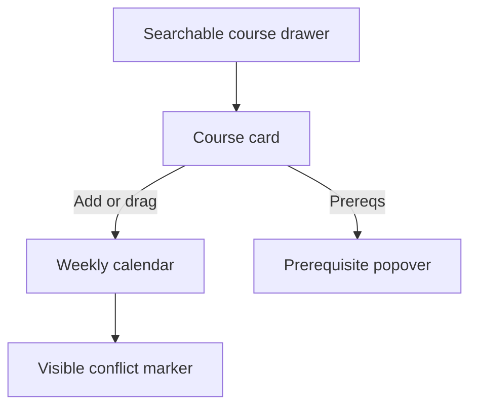
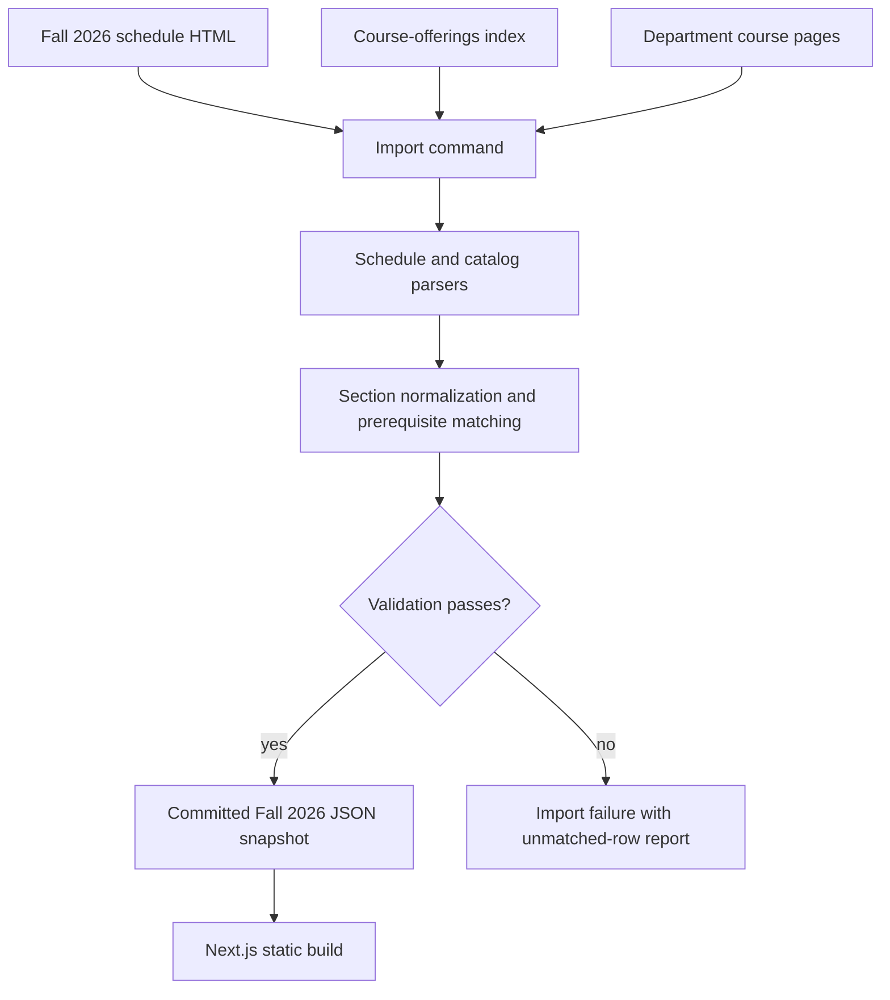
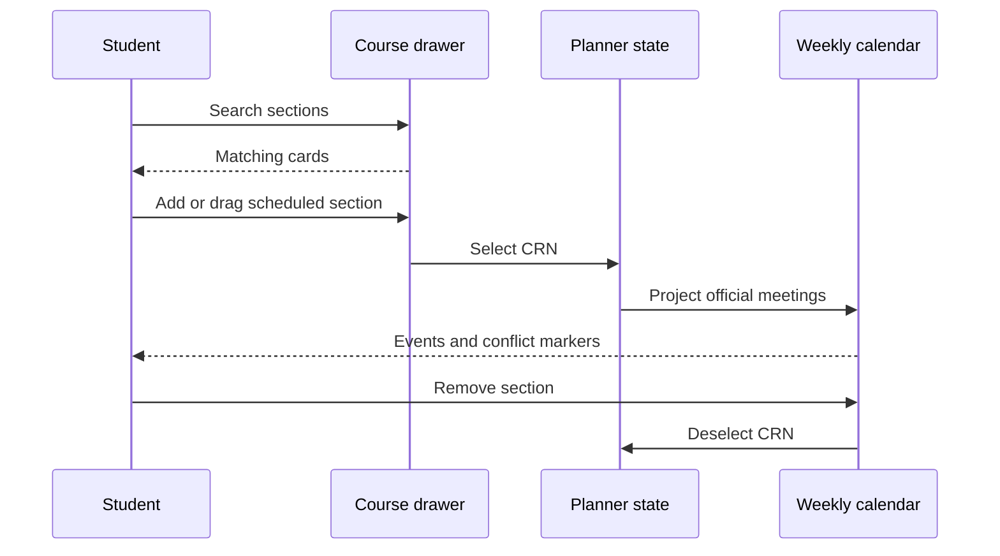
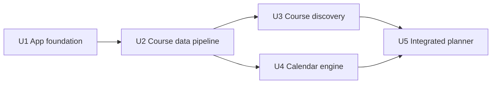

# Kenyon Class Schedule Planner - Plan

## Goal Capsule

- **Objective:** Give Kenyon students an immediate visual way to explore Fall 2026 class combinations without using spreadsheets or attempting registration.
- **Authority:** The Product Contract owns behavior and scope. The Planning Contract owns implementation choices. Implementation Units cite both and do not override them.
- **Execution profile:** Standard greenfield web application with a static release artifact and no runtime backend.
- **Stop conditions:** Stop if the importer cannot account for the official Fall 2026 schedule rows, or if implementation requires changing a settled Product Contract decision.
- **Tail ownership:** The implementing agent owns all units through the Verification Contract and Definition of Done.
- **Open blockers:** None.

---

## Product Contract

### Summary

Build an anonymous, calendar-first weekly planner for Kenyon's Fall 2026 course sections.
Students search a right-side course drawer, add or drag sections into one weekly calendar, inspect prerequisites on demand, and see conflicts without being prevented from exploring them.

### Problem Frame

Students currently assemble possible schedules through Plan Ahead and manual spreadsheet grids.
That process separates course discovery from the week-level view students need to compare times, instructors, and conflicts quickly.

### Key Decisions

- **Single Fall 2026 term:** The first release owns only Fall 2026 (session-settled: user-directed — chosen over adding Spring 2027 now: keep the first release focused); Spring 2027 is deferred. Governs R1, R9.
- **Calendar-first workspace:** The weekly calendar is the primary workspace and the course search drawer is secondary (session-settled: user-directed — chosen over a catalog-first or multi-scenario experience: the week view is the product's core value). Governs R1, R3, R5.
- **Exploratory conflicts:** Overlapping sections remain placeable and are visibly marked (session-settled: user-directed — chosen over confirmation or prevention: students should freely compare hypothetical schedules). Governs R6.
- **Ephemeral planning:** A schedule is temporary in the first release (session-settled: user-directed — chosen over surviving a browser refresh: persistence is not needed for the MVP). Governs R8.
- **Planning only:** The product does not register students or hand schedules to Plan Ahead (session-settled: user-directed — chosen over a future registration handoff: keep the product strictly for planning). Governs R10.
- **Fixed snapshot:** Course data is a fixed Fall 2026 snapshot (session-settled: user-directed — chosen over refreshing with official schedule changes: avoid a live-data promise in the MVP). Governs R9.
- **Untimed sections remain discoverable:** Sections without meeting times stay in search but cannot be placed (session-settled: user-directed — chosen over hiding them or adding an unscheduled area: retain discovery without implying a calendar time). Governs R2, R3, R11.

### Requirements

**Course discovery and inspection**

- R1. The app presents one searchable Fall 2026 course-section collection in a right-side drawer.
- R2. Each matching course card shows its course name, instructor, and meeting time or a Time unavailable state.
- R3. Each card with at least one scheduled meeting has an Add action and can be dragged into the calendar.
- R4. Each card provides a Prereqs action that reveals the section's prerequisite information in a small popover above that action.

**Weekly schedule exploration**

- R5. The primary view is a Monday-through-Friday weekly calendar that places every added meeting at its actual day and time.
- R6. The calendar permits overlapping sections and visibly identifies each time conflict without blocking the add action.
- R7. Students can remove an added section from the current calendar.
- R8. Refreshing the browser clears the temporary schedule.

**Product boundary and data**

- R9. The app uses a fixed Fall 2026 course snapshot and labels prerequisite information as reference material only.
- R10. The app does not provide registration, enrollment changes, eligibility enforcement, accounts, or saved schedules.
- R11. A section without a meeting time remains searchable, displays Time unavailable, and has calendar placement disabled.



### Actors

- A1. **Kenyon student:** Searches Fall 2026 sections and explores one hypothetical weekly schedule.

### Key Flows

- F1. Find and add a scheduled section
  - **Trigger:** A1 searches for a course, subject, or instructor.
  - **Steps:** Matching cards appear in the drawer. A1 clicks Add or drags a scheduled card into the calendar. The section's meetings appear on their official days and times.
  - **Outcome:** A1 can judge the section in the context of the current week.
  - **Covers:** R1, R2, R3, R5.

- F2. Inspect prerequisites
  - **Trigger:** A1 wants prerequisite context for a listed section.
  - **Steps:** A1 selects Prereqs on its card. A small popover opens above the action.
  - **Outcome:** A1 can read the information without leaving the planner.
  - **Covers:** R4, R9.

- F3. Explore a conflict
  - **Trigger:** A1 adds a section whose meeting overlaps one already on the calendar.
  - **Steps:** Both sections remain on the calendar. The overlap is visibly marked.
  - **Outcome:** A1 can compare the conflict and remove a section if desired.
  - **Covers:** R6, R7.

- F4. Inspect an untimed section
  - **Trigger:** A1 finds a section without a published meeting time.
  - **Steps:** The card shows Time unavailable. Calendar placement is disabled while prerequisite inspection remains available.
  - **Outcome:** A1 can discover the section without receiving a false calendar placement.
  - **Covers:** R2, R4, R11.

### Acceptance Examples

- AE1. **Given** a student searches for a scheduled Fall 2026 section, **when** they click Add, **then** every meeting for that section appears in the corresponding calendar slots. **Covers:** R1, R3, R5.
- AE2. **Given** a student has a section on the calendar, **when** they add another section that overlaps it, **then** both remain visible and the overlap is identified as a conflict. **Covers:** R6.
- AE3. **Given** a search-result card has prerequisite information, **when** a student selects Prereqs, **then** the information appears in a popover above that action. **Covers:** R4.
- AE4. **Given** a student refreshes the app after adding sections, **when** the app reloads, **then** it shows an empty temporary schedule. **Covers:** R8.
- AE5. **Given** a section has no published meeting time, **when** it appears in search, **then** its card shows Time unavailable and cannot be added or dragged. **Covers:** R2, R3, R11.

### Scope Boundaries

#### Deferred for later

- Spring 2027 and later terms.
- Saved accounts, persistent schedules, and multiple schedule scenarios.
- Live schedule, seat, waitlist, or enrollment-status updates.

#### Outside this product's identity

- Registration, Plan Ahead integration, or enrollment changes.
- Prerequisite enforcement, advising, or a claim that a student is eligible to enroll.

### Dependencies / Assumptions

- The public Fall 2026 schedule is the source for section titles, instructors, and meeting patterns.
- The 2026-27 Kenyon course catalog department pages are the reference source for prerequisite text where a matching catalog course exists.
- Special topics or other unmatched sections may show that prerequisite information is unavailable.

<!-- ce-section: work-relationships -->
### How This Work Fits Together

This plan owns the Fall 2026 single-schedule planner; future work remains contextual rather than committed scope.

- Spring 2027 support can proceed independently after the Fall 2026 data path and planning experience are proven.
- Persistent schedules and multi-scenario comparison depend on validating the single temporary workspace first.
- Registration handoff is outside the product's current identity and requires a separate product decision if revisited.

### Sources / Research

- [Kenyon Fall 2026 schedule by department](https://registrar.kenyon.edu/sep26_dept.htm) supplies the public section schedule fields.
- [Kenyon 2026-27 course catalog](https://www.kenyon.edu/offices-and-services/registrar/kenyon-college-course-catalog/) identifies the current catalog year.
- [Kenyon course offerings](https://www.kenyon.edu/offices-and-services/registrar/kenyon-college-course-catalog/course-offerings/) links the department course pages used for prerequisite enrichment.
- [Kenyon prerequisites feed](https://registrar.kenyon.edu/prereqs_next.htm) is not a Fall 2026 authority because its current rows cover Fall 2025 and Spring 2026.

---

## Planning Contract

### Product Contract Preservation

Product Contract changed with user approval: R2 and R3 were qualified for untimed sections, and R11, F4, and AE5 were added. No other product scope changed.

### Key Technical Decisions

- KTD1. **Static Next.js application:** Use the Next.js App Router with TypeScript and static export. Keep all runtime behavior in one client-side planner boundary. Do not add SQLite, route handlers, or a runtime server. (session-settled: user-approved — chosen over a Next.js plus SQLite backend: temporary state and a fixed dataset do not need persistence.) Governs R8, R9, R10.
- KTD2. **Committed course snapshot:** Generate the Fall 2026 dataset before release and commit the normalized output. Runtime code reads only that snapshot. (session-settled: user-approved — chosen over runtime scraping: the MVP promises a fixed schedule and must not depend on registrar availability.) Governs R1, R9.
- KTD3. **Strict source importer:** Parse the registrar schedule and catalog department pages with Cheerio, then validate every normalized record. Build the next snapshot and import report separately and replace both committed artifacts only after validation succeeds. This avoids fragile regular-expression parsing of malformed HTML and prevents a failed fetch or schema change from corrupting the last valid snapshot. Governs R1, R2, R4, R9, R11.
- KTD4. **Section-level domain model:** Key course sections by CRN. Store each official meeting as a separate normalized interval. Store prerequisite state as known text, no prerequisite, or unavailable. Governs R2, R4, R5, R7, R11.
- KTD5. **In-memory planner state:** Store selected CRNs in a client reducer. Make Add idempotent and remove a section as one action across all of its meetings. Use `@dnd-kit/react` for an accessible drag path while keeping Add as the equivalent keyboard and pointer action. (session-settled: user-approved — chosen over draggable rescheduling: dropping a card adds it at its official time.) Governs R3, R7, R8.
- KTD6. **Custom weekly time grid:** Render a purpose-built CSS time grid from normalized meeting intervals instead of adopting a general calendar package. Official meetings are immutable, weekday-only placements, so a focused grid avoids unused date, time-zone, editing, and recurrence behavior. Detect conflicts with interval-overlap logic per weekday and expose a non-color status. Governs R5, R6.
- KTD7. **Laptop-first responsive shell:** Keep the calendar and drawer visible together at desktop widths. Use a collapsible overlay drawer and horizontal calendar scrolling at smaller widths. (session-settled: user-approved — chosen over a separate mobile planner: preserve the same MVP behavior across widths.) Governs R1, R5.
- KTD8. **Layered verification:** Use fixture-based parser tests, Vitest with React Testing Library for domain and component behavior, and Playwright for the complete planner flows. Governs AE1, AE2, AE3, AE4, AE5.

### High-Level Technical Design

The release pipeline converts external registrar pages into a reviewed static artifact. The deployed app does not fetch Kenyon sources.



The runtime planner owns one ephemeral selection state. Search cards and the calendar project from the same normalized section collection.



### Implementation Constraints

- Runtime code must not fetch registrar or catalog pages.
- The dataset must remain inspectable and source-attributed.
- Dragging must never change an official day or time.
- Add, remove, search, prerequisite disclosure, and conflict state must be keyboard operable.
- Conflict state and disabled placement must not rely on color alone.

### Sequencing



### Risks & Mitigations

- **Registrar HTML drift:** Fixture-based parsing and an unmatched-row failure report prevent silent data loss.
- **Source fetch failure:** The import command keeps the last valid snapshot unchanged until all fetch, parse, match, and validation stages succeed.
- **Prerequisite coverage gaps:** The importer distinguishes no prerequisite from unavailable information and preserves source attribution.
- **Complex meeting patterns:** The normalized model keeps multiple meetings per section and validates day and time intervals independently.
- **Dense calendar conflicts:** The calendar groups overlapping intervals and keeps course identity readable through labels and accessible conflict status.
- **Drag accessibility:** The Add action remains the primary equivalent path and the drag library receives keyboard coverage.
- **Large client dataset:** The importer emits only fields required by the Product Contract, and search operates on a precomputed normalized text field.

### External Guidance

- [Next.js static export guidance](https://nextjs.org/docs/app/guides/static-exports) supports a serverless HTML, CSS, and JavaScript output.
- [Next.js testing guidance](https://nextjs.org/docs/app/guides/testing) supports Vitest for unit and component tests and Playwright for browser flows.
- [dnd kit React guidance](https://dndkit.com/react/quickstart/) provides draggable and droppable primitives with multiple input sensors.
- [Cheerio loading guidance](https://cheerio.js.org/docs/basics/loading/) supports parsing static HTML documents in a Node.js import script.

### Documentation / Operational Notes

- `README.md` must describe the fixed-snapshot model, source URLs, import workflow, verification workflow, and static deployment output.
- The importer must record source URLs, retrieval timestamps, and row counts beside the generated dataset.
- Production builds must validate the committed snapshot but must not regenerate it or require network access.
- A maintainer must inspect the import report before committing a regenerated term snapshot.

---

## Output Structure

```text
.
├── next.config.ts
├── eslint.config.mjs
├── package.json
├── package-lock.json
├── playwright.config.ts
├── README.md
├── tsconfig.json
├── vitest.config.mts
├── e2e/
│   └── planner.spec.ts
├── scripts/
│   └── courses/
│       ├── import-fall-2026.ts
│       ├── parse-catalog.ts
│       └── parse-schedule.ts
├── src/
│   ├── app/
│   │   ├── globals.css
│   │   ├── layout.tsx
│   │   └── page.tsx
│   ├── components/
│   │   └── planner/
│   │       ├── course-card.tsx
│   │       ├── course-search-drawer.tsx
│   │       ├── planner-shell.tsx
│   │       ├── prerequisite-popover.tsx
│   │       └── weekly-calendar.tsx
│   ├── data/
│   │   ├── fall-2026.import-report.json
│   │   └── fall-2026.json
│   └── lib/
│       └── courses/
│           ├── conflicts.ts
│           ├── planner-state.ts
│           ├── schedule.ts
│           ├── search.ts
│           └── types.ts
└── tests/
    ├── components/
    ├── fixtures/kenyon/
    ├── lib/
    └── scripts/
```

---

## Implementation Units

### U1. Establish the static application foundation

**Goal:** Create the Next.js application shell, static-export configuration, styling baseline, and test harnesses.

**Requirements:** R5, R8, R10. Supports A1.

**Dependencies:** None.

**Files:**

- `package.json`
- `package-lock.json`
- `eslint.config.mjs`
- `next.config.ts`
- `tsconfig.json`
- `vitest.config.mts`
- `playwright.config.ts`
- `src/app/layout.tsx`
- `src/app/page.tsx`
- `src/app/globals.css`
- `README.md`
- `tests/components/page.test.tsx`

**Approach:**

1. Scaffold a TypeScript App Router project with static export enabled per KTD1.
2. Add scripts for type checking, linting, unit tests, browser tests, data import, data verification, and production build.
3. Establish global layout tokens for the restrained laptop-first planner shell in KTD7.
4. Configure Vitest with a browser-like test environment and configure Playwright against the production-style app.
5. Document the static architecture and verification entry points without documenting a deployment host that has not been selected.

**Patterns to follow:** Next.js App Router conventions and the official Vitest and Playwright guides cited in External Guidance.

**Test scenarios:**

- Render the root page and verify that the planner landmark and Fall 2026 context are present.
- Build the application as a static export and verify that the root route has no server-only dependency.

**Verification:** The application renders from a static build, and the lint, type, unit-test, and browser-test entry points are available.

### U2. Build and validate the Fall 2026 course snapshot

**Goal:** Produce the committed course-section dataset from the official schedule and catalog pages.

**Requirements:** R1, R2, R4, R9, R11. Covers F2, F4, AE3, AE5.

**Dependencies:** U1.

**Files:**

- `scripts/courses/import-fall-2026.ts`
- `scripts/courses/parse-schedule.ts`
- `scripts/courses/parse-catalog.ts`
- `src/lib/courses/types.ts`
- `src/data/fall-2026.import-report.json`
- `src/data/fall-2026.json`
- `tests/fixtures/kenyon/fall-2026-schedule.html`
- `tests/fixtures/kenyon/catalog-course-page.html`
- `tests/scripts/parse-schedule.test.ts`
- `tests/scripts/parse-catalog.test.ts`
- `tests/scripts/import-fall-2026.test.ts`

**Approach:**

1. Fetch the named Kenyon sources only from the import command.
2. Parse the fixed-width schedule block into section records keyed by CRN.
3. Discover department catalog pages from the course-offerings index and extract course codes with prerequisite sentences.
4. Match catalog courses to sections by normalized subject and catalog number while preserving each section identity.
5. Emit the next runtime snapshot, source metadata, and validation report into a temporary output location.
6. Replace the committed snapshot and import report only after every import validation succeeds.
7. Fail the import when a row is malformed, a CRN is duplicated, a timed meeting is invalid, or a source row is silently dropped.

**Patterns to follow:** KTD2, KTD3, KTD4, and Cheerio's static-document parsing model.

**Test scenarios:**

- Parse a standard multi-day schedule row into one section with one repeated meeting pattern.
- Parse a section with a secondary meeting pattern into independent normalized intervals.
- Parse an arranged section with no meeting time and preserve it as unavailable for placement.
- Preserve titles, instructors, CRNs, course codes, and section numbers from representative schedule rows.
- Extract explicit prerequisite text, a No prerequisite statement, and permission-only language from catalog descriptions.
- Mark a special-topic or unmatched section as prerequisite unavailable without treating it as no prerequisite.
- Reject duplicate CRNs, invalid day codes, reversed time intervals, and unaccounted source rows.
- Preserve the last valid snapshot when a source request fails or the fetched HTML no longer matches the expected structure.
- Verify the committed snapshot against the importer schema without network access.

**Verification:** The committed snapshot passes schema validation, every source schedule row is classified, and an import report lists counts and unmatched prerequisite records.

### U3. Implement course discovery and prerequisite disclosure

**Goal:** Let students find Fall 2026 sections and inspect accurate card-level details.

**Requirements:** R1, R2, R4, R11. Covers F1, F2, F4, AE3, AE5.

**Dependencies:** U2.

**Files:**

- `src/components/planner/course-search-drawer.tsx`
- `src/components/planner/course-card.tsx`
- `src/components/planner/prerequisite-popover.tsx`
- `src/lib/courses/search.ts`
- `tests/components/course-search-drawer.test.tsx`
- `tests/components/course-card.test.tsx`
- `tests/components/prerequisite-popover.test.tsx`
- `tests/lib/search.test.ts`

**Approach:**

1. Search a normalized text index across subject, catalog number, title, and instructor.
2. Render stable result ordering by subject, number, and section.
3. Keep prerequisite disclosure local to its card and return focus to its trigger when closed.
4. Apply R11 to untimed cards while preserving search and prerequisite access.

**Patterns to follow:** Semantic form controls, WAI-ARIA disclosure semantics, KTD4, and KTD7.

**Test scenarios:**

- Match a section by subject code, catalog number, title fragment, and instructor name without case sensitivity.
- Show an empty-query browse state and a clear no-results state.
- Render course name, instructor, and formatted meetings for a scheduled card.
- Covers F2 / AE3. Open prerequisite text above the trigger and close it with pointer, keyboard, and Escape interactions.
- Distinguish explicit no prerequisite from unavailable prerequisite information.
- Covers F4 / AE5. Show Time unavailable and disable Add and drag for an untimed section.
- Preserve keyboard focus and accessible names for search, Add, and Prereqs controls.

**Verification:** Students can discover every snapshot section and inspect prerequisite state without leaving the planner or using a pointer.

### U4. Implement schedule state, calendar geometry, and conflicts

**Goal:** Project selected sections into the weekly calendar and make overlaps understandable.

**Requirements:** R3, R5, R6, R7, R8. Covers F1, F3, AE1, AE2, AE4.

**Dependencies:** U2.

**Files:**

- `src/lib/courses/planner-state.ts`
- `src/lib/courses/schedule.ts`
- `src/lib/courses/conflicts.ts`
- `src/components/planner/weekly-calendar.tsx`
- `tests/lib/planner-state.test.ts`
- `tests/lib/schedule.test.ts`
- `tests/lib/conflicts.test.ts`
- `tests/components/weekly-calendar.test.tsx`

**Approach:**

1. Keep selected CRNs in reducer state per KTD5.
2. Derive calendar events from the selected sections instead of storing a second mutable event list.
3. Map normalized minutes to grid positions per KTD6.
4. Group overlapping intervals by weekday and expose the conflict relation to every affected event.
5. Remove a CRN once and derive removal of all corresponding meetings.

**Patterns to follow:** Pure domain utilities, derived React state, KTD5, and KTD6.

**Execution note:** Implement the pure interval and state rules test-first before connecting them to rendered calendar geometry.

**Test scenarios:**

- Covers F1 / AE1. Add a section once and project all of its official meetings into the correct weekdays and times.
- Add the same CRN twice and keep only one selected section.
- Remove a section and remove all derived meetings for that CRN.
- Treat intervals that only touch at an endpoint as non-conflicting.
- Mark partial overlap, containment, and three-way overlap as conflicts for all affected events.
- Covers F3 / AE2. Render both overlapping sections and expose a non-color conflict indicator.
- Render early, late, short, and long meetings within the calendar bounds.
- Initialize with an empty selection so a new page load has no scheduled sections.

**Verification:** Calendar placement is deterministic from source meetings, conflict detection is correct at interval boundaries, and selected state has no persistence path.

### U5. Integrate click, drag, responsive layout, and browser flows

**Goal:** Deliver the complete planner interaction across laptop and smaller viewport layouts.

**Requirements:** R1, R3, R4, R5, R6, R7, R8, R10, R11. Covers F1, F2, F3, F4 and all acceptance examples.

**Dependencies:** U3, U4.

**Files:**

- `src/components/planner/planner-shell.tsx`
- `src/components/planner/course-card.tsx`
- `src/components/planner/course-search-drawer.tsx`
- `src/components/planner/weekly-calendar.tsx`
- `src/app/page.tsx`
- `src/app/globals.css`
- `tests/components/planner-shell.test.tsx`
- `e2e/planner.spec.ts`

**Approach:**

1. Load the committed snapshot into one planner shell and keep state inside that client boundary.
2. Connect Add and drag completion to the same select-CRN action per KTD5.
3. Make the whole calendar a drop target while preserving official placement after drop.
4. Compose the desktop split view and the smaller-screen overlay drawer per KTD7.
5. Verify that the browser makes no runtime Kenyon request.

**Patterns to follow:** `@dnd-kit/react` provider and sensor patterns, semantic landmarks, and the KTD5 state boundary.

**Test scenarios:**

- Covers AE1. Search for a scheduled section and add it with the card action.
- Drag the same type of card onto any calendar region and get the same official placement as Add.
- Add two overlapping sections and see both events with accessible conflict status.
- Open and close a prerequisite popover without changing planner state.
- Remove a selected section and restore its card to an addable state.
- Covers AE4. Refresh after adding sections and return to an empty calendar.
- Covers AE5. Find an untimed section and verify that click and drag placement are unavailable.
- Use the complete search, prerequisite, Add, conflict, and remove flow by keyboard.
- At a narrow viewport, open the overlay drawer, add a section, close the drawer, and inspect the horizontally scrollable week.
- Observe no network request to a Kenyon domain during load or interaction.

**Verification:** The full acceptance flow works through Add and drag, all core actions are keyboard operable, and the static app stays functional at desktop and narrow viewport widths.

---

## Verification Contract

| Gate | Command | Proves |
|---|---|---|
| Static data | `npm run data:verify` | The committed snapshot matches the schema and import invariants without network access. |
| Types | `npm run typecheck` | Domain, component, and importer contracts agree. |
| Lint | `npm run lint` | Source and test files satisfy project quality rules. |
| Unit and component tests | `npm run test` | Parser, search, state, calendar, conflict, card, popover, and shell scenarios pass. |
| Browser flows | `npm run test:e2e` | The Product Contract flows and acceptance examples work in a real browser. |
| Static production build | `npm run build` | Next.js produces the deployable static artifact with no server-only dependency. |

Additional release gates:

- The import report accounts for every source schedule row and identifies every unmatched prerequisite record.
- Browser tests cover click Add, drag Add, remove, conflict display, prerequisite disclosure, untimed sections, refresh reset, keyboard use, and the narrow viewport.
- Browser network inspection confirms that the planner does not contact Kenyon or another data service at runtime.
- Visual conflict state and disabled placement have a non-color cue.

---

## Definition of Done

### Global

- The Product Contract requirements R1 through R11 are implemented or explicitly proven by the Verification Contract.
- The Fall 2026 snapshot is reproducible from named official sources and validates without network access after generation.
- The static application exposes no account, registration, persistence, or live-data behavior.
- The main student flows work with pointer and keyboard input at desktop and narrow viewport widths.
- All Verification Contract gates pass.
- Abandoned experiments, unused dependencies, debug output, and dead-end implementation code are removed.

### Per Unit

| Unit | Done signal |
|---|---|
| U1 | A static Next.js shell builds and all verification entry points are configured. |
| U2 | The committed dataset validates, source rows are accounted for, and importer tests cover schedule and prerequisite variants. |
| U3 | Search, card details, prerequisite disclosure, and untimed-section behavior pass component tests. |
| U4 | Calendar projection, in-memory selection, removal, and conflict rules pass domain and component tests. |
| U5 | All acceptance flows pass in a real browser with Add, drag, keyboard, refresh, and responsive coverage. |

### Product Contract Preservation

- The only Product Contract change is the confirmed untimed-section behavior recorded in R2, R3, R11, F4, and AE5.
- All session-settled annotations and their governed requirement links remain present.
